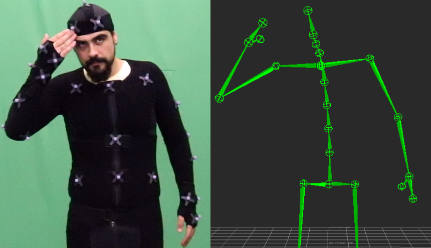
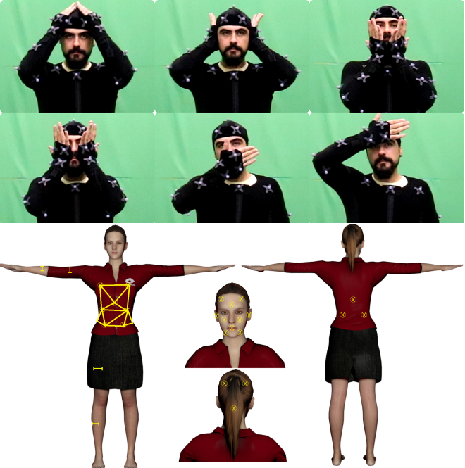
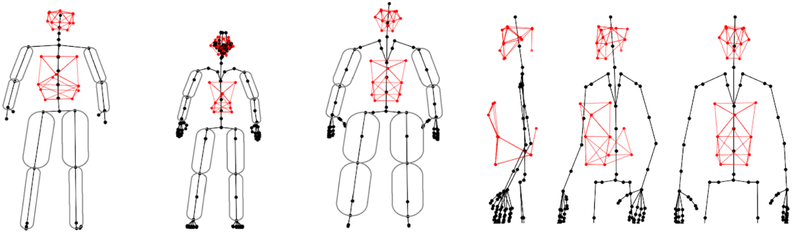
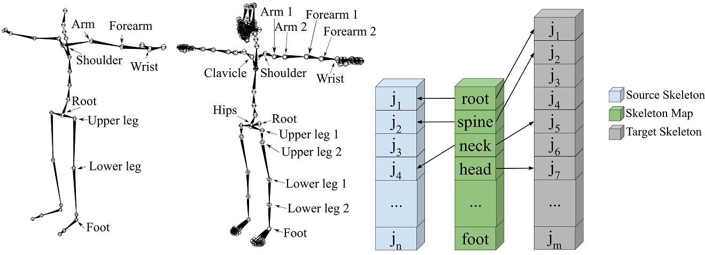
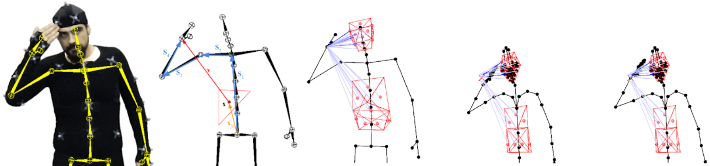
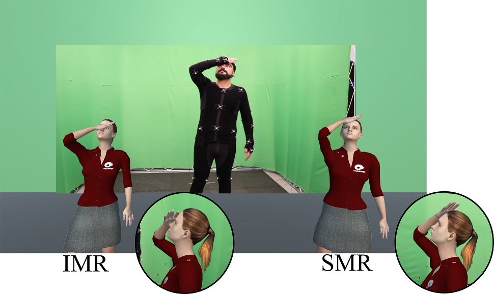

### **Motion Retargeting Preserving Spatial Relationship**

This work proposes the motion retargeting of motion capture data to 3D characters preserving the hands’ spatial relationship with the body surface. This process ensures the interaction of the hands with the body surface, such as covering the eyes or mouth.

<em>The full text is available [here](https://repositorio.unicamp.br/Acervo/Detalhe/1157398) and the code [here](https://github.com/rltonoli/MScTonoli).</em>

{: style="text-align: justify; " }
Motion capture (mocap) is a digital animation technique. Mocap systems capture the live performance of an actor and animate a 3D character using the recorded motion. Most systems use a set of infrared cameras to track the position over time of reflective markers placed on the body surface of the performer. Mocap systems are known for tracking motion with high accuracy.
 
 
When working with mocap, a typical problem occurs when the performer proportions are too different from the virtual character. For example, when the movements of a skinny actress must be transferred to a fat ogress. Applying the animation sequence in a 3D character with different body proportions and body shapes may result in an odd-looking, unnatural motion. As the example on the right, the same motion (center) is applied to two characters, one is a small goblin (left), and the other is a tall soldier (right). Notice the different places that their hands touch (or don't touch) their bodies.

<iframe style="padding-left: 100px;" width="560" height="315" src="https://www.youtube.com/embed/6klk4lU98R4" frameborder="0" allow="accelerometer; autoplay; encrypted-media; gyroscope; picture-in-picture" allowfullscreen></iframe>

### **Adopted Method**

**Overview**

{: style="text-align: justify; " }
In this work, we propose to include the concept of skeleton correspondence adopted by Monzani et al. [1] to the egocentric coordinate encoding pipeline proposed by Molla et al. [2]. The body surfaces of the actor and the virtual character are calibrated in a semi-automatic process. A mesh composed of triangles is constructed to represent each body surface, and the limbs, upper and lower arms and legs, are modeled as capsules. For the captured motion, the hands' and feet' distance to the performer’s body surface components, i.e., triangles and capsules, are normalized by the body proportions. Then, the virtual character’s body proportions and body surface are used to compute its hands and feet positions. The character pose is adjusted by inverse kinematics for each frame of the animation.
 
 
In summary, the proposed method includes four steps:

1. Estimate the performer body surface
2. Estimate the character body surface
3. Map mocap and character skeletons (if the skeletons have different topology and/or hierarchy)
4. Compute the character's correct pose

{: style="text-align: justify; " }
**(Step 1)** The surface calibration of the mocap performer occurs at the beginning of the mocap procedure. The performer must touch the surface of the body with his hands in the same position as the set of points defined. The movements of the surface calibration are captured as mocap clips, saved as BVH files, and the positions of the surface points are retrieved automatically. The surface calibration is required only once per mocap performer.
 
 
**(Step 2)** A 3D artist or an animator obtains the same surface points through manual inspection in 3D modeling software to calibrate the surface of the virtual character. This information can be reused for every motion applied to this character. Motion retargeting to new characters requires performing this process to specify its body surface.

Some body surfaces obtained during the project, the second and third ones belong to virtual characters, the others are from a human performer:

{: style="text-align: justify; " }
**(Step 3)** A correspondence between joints of the skeletons is mandatory to identify which joints from the target (character) skeleton should mimic the motion from the source (mocap) skeleton. This step is useful to map joints correctly and to perform the motion retargeting

{: style="text-align: justify; " }
**(Step 4)** Frame by frame, the positions of the hands are encoded relative to their distance and orientation of each body surface component (mesh triangles and limb capsules).
 
 
Then, the body surface components of the virtual character are used to decode the position of the hands.

From left to right: photo during mocap; mocap hand position relative to one mesh triangle; mocap hand position relative to all mesh triangles; character hand position before the adopted method (red "X" mark the correct place); character hand position adjusted using inverse kinematics.

**Perceptual Evaluation**

{: style="text-align: justify; " }
We conducted a perceptual evaluation that focused on assessing the contribution of the implemented motion retargeting methodology to a greater animation videorealism.
 
 
The evaluation was conducted showing to volunteer participants: (1) the recorded video of the performer during the mocap session; (2) the retargeted animations using a simple motion retargeting approach; and (3) the retargeted animation resulting from the adopted method. The participants were asked to evaluate the retargeted animations compared to the “gold-standard” provided by the recorded video of the performer. The subjects were asked which animation they think best represents the movements in the video. They could choose one of the answers: "The left one"; "The right one"; "They are identical and represent the movement well"; "They are identical and do not represent the movement well". Note that the characters were placed randomly.
 
 
The evaluation involved 25 volunteer subjects, and each one evaluated 9 animations, resulting in 225 answers. From the answers, 72.9% of the cases the participants preferred the retargeted motion by the implemented method; 8.4% by the simple approach; 15.1% of the answers indicated that both motions are identical and represented the movement in the video; and 3.6% that they were identical and did not represent the movement in the video.

{: style="text-align: justify; " }
Example of an animation presented during the perceptual evaluation (zoomed figures added for visualization purposes only and were not present in the evaluation). The right one was retargeted using the method presented above; the left one was retargeted by coping the rotations from the source animation (mocap), part of the character's hand is penetrating its face.

**References**

{: style="text-align: justify; " }
[1] Monzani, Jean‐Sébastien, Paolo Baerlocher, Ronan Boulic, and Daniel Thalmann. "Using an intermediate skeleton and inverse kinematics for motion retargeting." In Computer Graphics Forum, vol. 19, no. 3, pp. 11-19. Oxford, UK and Boston, USA: Blackwell Publishers Ltd, 2000.
 
 
[2] Molla, Eray, Henrique Galvan Debarba, and Ronan Boulic. "Egocentric mapping of body surface constraints." IEEE transactions on visualization and computer graphics 24, no. 7 (2017): 2089-2102.