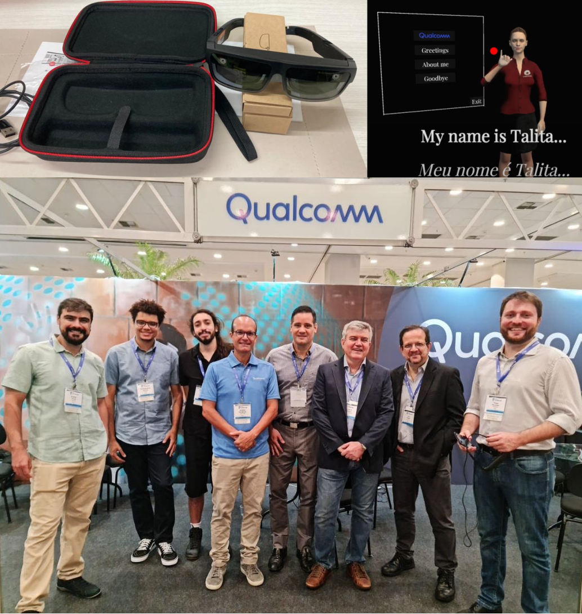

Other relevant projects

### **bvhsdk Python Library**

During my Master's program, I developed bvhsdk, a Python library for handling BVH files. This library can be valuable for researchers in motion capture analysis and students studying computer animation.

[PyPI](https://pypi.org/project/bvhsdk/) [Github](https://github.com/rltonoli/bvhsdk) [Documentation](https://bvhsdk.readthedocs.io/)

 

### **MSc C# Unity**

*(Work in progress)* I'm currently in the process of porting the code for my [master's project](/msc/) from Python to C#. 

The Unity project in C# is available [here](https://github.com/rltonoli/mr-unity), and the original implementation in Python is available [here](https://github.com/rltonoli/MScTonoli).

<iframe style="padding-left: 100px;" width="560" height="315" src="https://www.youtube.com/embed/SUvC6K-xHvA" frameborder="0" allow="accelerometer; autoplay; encrypted-media; gyroscope; picture-in-picture" allowfullscreen></iframe>

 

### **Motion Capture**

I have conducted motion capture sessions for all sorts of projects with their unique quirks and done some post-processing and data clean-up using Vicon Shogun. I've also shown students and fellow researchers how to operate the motion capture system and get the best out of their sessions.

<iframe style="padding-left: 100px;" width="560" height="315" src="https://www.youtube.com/embed/6x8jzeydRq4" frameborder="0" allow="accelerometer; autoplay; encrypted-media; gyroscope; picture-in-picture" allowfullscreen></iframe>

 

### **Signing Avatar showcase at IEEE Globecom 2022**

Our team from FEEC/UNICAMP, in partnership with [Qualcomm](https://www.qualcomm.com/), showcased a demonstration of the sign language avatar from the [TAS project](https://www.tas.fee.unicamp.br/) using the [AR ThinkReality A3 Smart Glasses](https://www.lenovo.com/us/en/thinkrealitya3/) at the [IEEE Globecom 2022](https://globecom2022.ieee-globecom.org/). This demonstration was conducted under the guidance of Prof. José Mario De Martino.

### **Signing Avatar in Virtual Reality: An Intelligibility Study**

Sign language avatar is an assistive technology used to convey information and support interaction for the deaf and hard of hearing. In this paper, the intelligibility of a signing avatar was evaluated using a Virtual Reality (VR) Head Mounted Display (HMD) and a conventional computer screen. Results show evidence that the deaf and hard of hearing individuals better understand sign language content displayed on a VR HMD than on a flat screen.

This finding could leverage the adoption of VR HMD in schools to aid the educational process of deaf individuals. In addition, assistive technologies with signing avatars could use VR devices to better explore sign language visuospatial characteristics, enhancing the accessibility and increasing the technology acceptance by the deaf community.

### **Class Project**

<strong> IA725 - Computer Graphics I</strong>

[Github](https://github.com/rltonoli/Java-JOGL)

<iframe src="https://giphy.com/embed/OFT5diw3BOI32FWoTk" width="100%" height="100%" style="position:absolute" frameBorder="0" class="giphy-embed" allowFullScreen></iframe>

<a href="https://giphy.com/gifs/OFT5diw3BOI32FWoTk">via GIPHY</a>

<strong> MO815 - Volumetric Image Visualization</strong>

[Github](https://github.com/rltonoli/MO815)

<iframe src="https://giphy.com/embed/sYqfPLd1asj7a44HN7" width="100%" height="100%" style="position:absolute" frameBorder="0" class="giphy-embed" allowFullScreen></iframe>

<a href="https://giphy.com/gifs/sYqfPLd1asj7a44HN7">via GIPHY</a>

<iframe src="https://giphy.com/embed/Qd8tYR7sd1zX1qKcys" width="100%" height="100%" style="position:absolute" frameBorder="0" class="giphy-embed" allowFullScreen></iframe>

<a href="https://giphy.com/gifs/Qd8tYR7sd1zX1qKcys">via GIPHY</a>

<iframe src="https://giphy.com/embed/PWLjAiMItkEesQVfPL" width="100%" height="100%" style="position:absolute" frameBorder="0" class="giphy-embed" allowFullScreen></iframe>

<a href="https://giphy.com/gifs/PWLjAiMItkEesQVfPL">via GIPHY</a>

<strong> IA369 - Data Visualization</strong>

[Github](https://github.com/rltonoli/IA369)

<strong> MO444 - Machine Learning</strong>

Github (N/A)

<strong> MO416 - Introduction to Artificial Inteligence</strong>

[Github](https://github.com/rltonoli/MO416)

<strong> IA369 - Affective Computing</strong>

[Github](https://github.com/rltonoli/IA369_AffectiveComputing)

