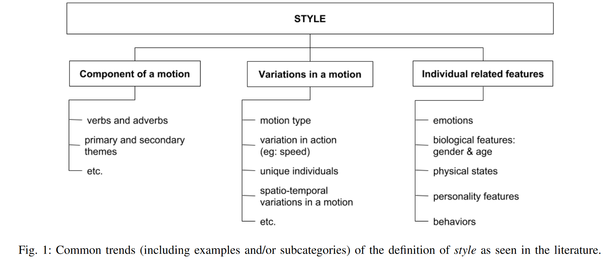
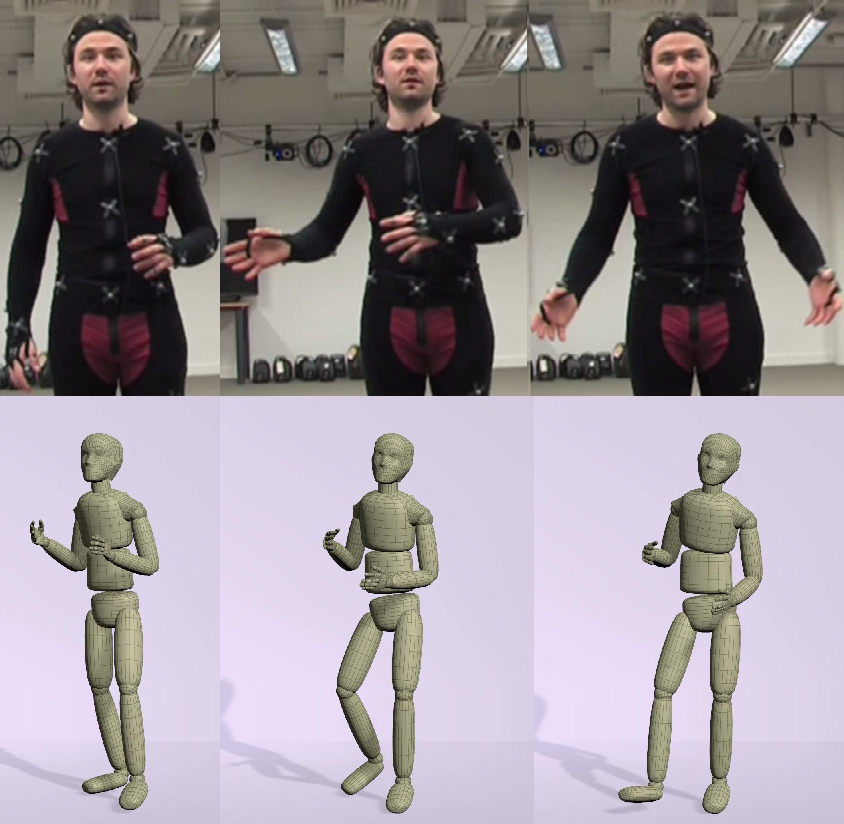

Speech-Driven Expressive Gesture Generation

We are working on a speech-to-gesture synthesizer. Virtual characters with expressive body movements may improve the human perception of a connected and reactive virtual world.

{: style="text-align: justify; margin-top:1cm;" }
We're finalizing a paper detailing our approach and findings. In the meantime, here's a glimpse of what our model can generate:

<iframe style="padding-left: 100px;" width="560" height="315" src="https://youtu.be/QSHPmrcTKt0" frameborder="0" allow="accelerometer; autoplay; encrypted-media; gyroscope; picture-in-picture" allowfullscreen></iframe>

{: style="text-align: justify; margin-top:1cm;" }
Stay tuned for the publication!

{: style="text-align: justify; margin-top:1cm;" }
Character animations are hard and expensive to create. Crafting all the animations for several characters in a videogame may present a bottleneck in the production pipeline - especially for RPG games that offer non-linear and highly branched narratives (The Witcher 3: Wild Hunt, as an example, has [35 hours of dialogues!](https://www.youtube.com/watch?v=chf3REzAjgI)). A similar bottleneck is found in applications with weekly or daily content creation, such as the [virtual influencer Lu](https://www.virtualhumans.org/article/who-is-virtual-influencer-and-magalu-spokesperson-lu) of the retail company Magalu. 
 
 
Since "hand-made" animation techniques such as keyframing are time demanding and a motion capture system is expensive (either to buy or to rent), it is infeasible to create an individual animation for every dialogue option and every character in the game. A typical approach is to create a database of small actions and gestures, then, through a script or an animator, choose and concatenate some of these small animation clips to compose a dialogue. Also, those small actions are shared among every character. However, the result may appear that the speech is detached from the gestures and may seem repetitive.
 
 
Furthermore, the virtual agents should behave in consonance with their intended personality and current emotions. Often, the player's actions and choices throughout the game may change the other characters' feelings toward the player, impacting their behavior. This leads to a vast number of animations.
 
 
We propose a deep learning model capable of generating expressive body movements for dialogues (i.e., gestures) based on the recorded speeches. This project comprises three phases:

* <strong>Create Dataset:</strong> record audio and body movements simultaneously using the motion capture system from Galileu Laboratory at Unicamp. Professional actors/actresses will perform scripted dialogues simulating different emotions.

* <strong>Develop Model:</strong> recent state-of-the-art research shows great results using deep learning architectures such as RNNs, GANs, and Transformers. We propose a model that receives as input a speech (prosodic features) and a tag with the intended emotion and outputs an animation clip.

* <strong>Perceptual Evaluation:</strong> assess the proposed model. A group of volunteers will evaluate a virtual agent regarding its gestures based on naturalness and accordance with the audio and intended emotion.

### **Related Works**

{: style="text-align: justify; margin-top:1cm; margin-bottom:1cm" }
Recent researches have focused on motion style generation to automatically create combinations of actions and styles based on motion capture datasets [1]. As depicted in Figure 1, style in body motion comprehends components that affect our movements.

<figure >

<figcaption style="text-align:center">Figure extracted from [1]</figcaption>
</figure>

{: style="text-align: justify; margin-top:1cm; " }
In contrast to rule-based systems, deep learning algorithms had success in performing faster [2], requiring smaller datasets [3], allowing different content than the database [4], and even being capable of running in real-time on mobile devices [5].
 
 
However, most research in the field of style in human motion has focused on stylistic locomotion and other actions such as walking, running, kicking, punching, jumping, and dancing rather than body movements and gestures during interactions and dialogue. Non-verbal communication elements are also susceptible to differences in style. Such elements include posture, hand gestures, and head movements. Furthermore, they often reveal physical and biological features, current emotions, or personality traits.

<figure>

<figcaption style="text-align:center">Top and bottom figures extracted and modified from [6] and [7], respectively.</figcaption>
</figure>

{: style="text-align: justify; margin-top:1cm;" }
Ferstl et al. proposed the use of Generative Adversarial Networks (GANs) to generate gestures based on gesture phasing [6]. Gestures may be classified in different phases: preparation, stroke, retraction, among others. In their work, they created a dataset of an actor freely speaking about his life and other topics; part of this dataset was annotated by hand with the respective gesture phase being performed. Given an unseen speech, the model first classifies which gesture phase should be executed, and the generator outputs the animation. Four discriminators are employed to assess the quality of the gesture phasing classification and the generated motion.
 
 
Alexanderson et al. employed a combination of Normalising Flow and LSTM to control the style of the generated motion. Their model receives the speech as input and a control input that changes components of the output motion. They proposed and evaluated generated motions with hand height, velocity, gesture radius, and gesture symmetry control

### **References**

{: style="text-align: justify; margin-top:1cm;" }
[1] Ribet, Sarah, Hazem Wannous, and Jean-Philippe Vandeborre. "Survey on style in 3d human body motion: Taxonomy, data, recognition and its applications." IEEE Transactions on Affective Computing (2019).
 
 
[2] Holden, Daniel, Ikhsanul Habibie, Ikuo Kusajima, and Taku Komura. "Fast neural style transfer for motion data." IEEE computer graphics and applications 37, no. 4 (2017): 42-49.
 
 
[3] Mason, Ian, Sebastian Starke, He Zhang, Hakan Bilen, and Taku Komura. "Few‐shot Learning of Homogeneous Human Locomotion Styles." In Computer Graphics Forum, vol. 37, no. 7, pp. 143-153. 2018.
 
 
[4] Du, Han, Erik Herrmann, Janis Sprenger, Noshaba Cheema, Somayeh Hosseini, Klaus Fischer, and Philipp Slusallek. "Stylistic Locomotion Modeling with Conditional Variational Autoencoder." In Eurographics (Short Papers), pp. 9-12. 2019.
 
 
[5] Smith, Harrison Jesse, Chen Cao, Michael Neff, and Yingying Wang. "Efficient neural networks for real-time motion style transfer." Proceedings of the ACM on Computer Graphics and Interactive Techniques 2, no. 2 (2019): 1-17.
 
 
[6] Ferstl, Ylva, Michael Neff, and Rachel McDonnell. "Adversarial gesture generation with realistic gesture phasing." Computers & Graphics 89 (2020): 117-130.
 
 
[7] Alexanderson, Simon, Gustav Eje Henter, Taras Kucherenko, and Jonas Beskow. "Style‐Controllable Speech‐Driven Gesture Synthesis Using Normalising Flows." In Computer Graphics Forum, vol. 39, no. 2, pp. 487-496. 2020.