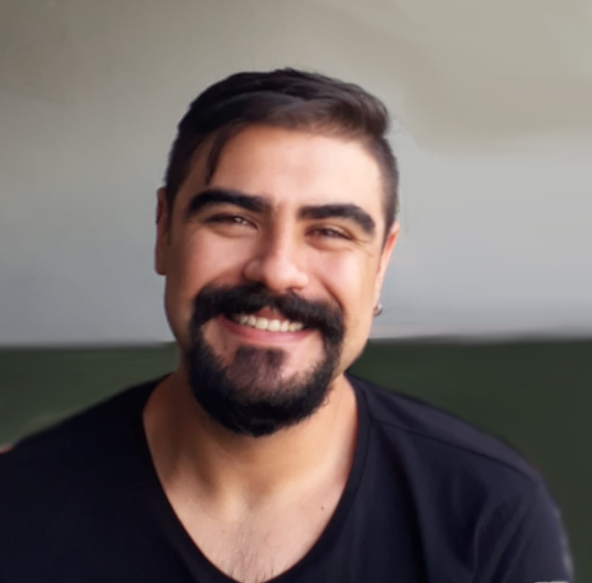
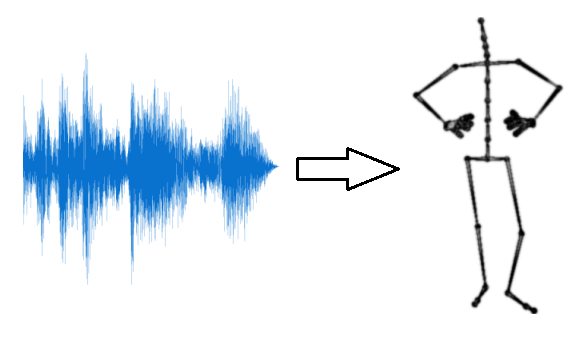
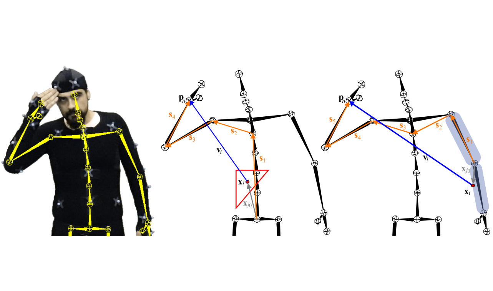
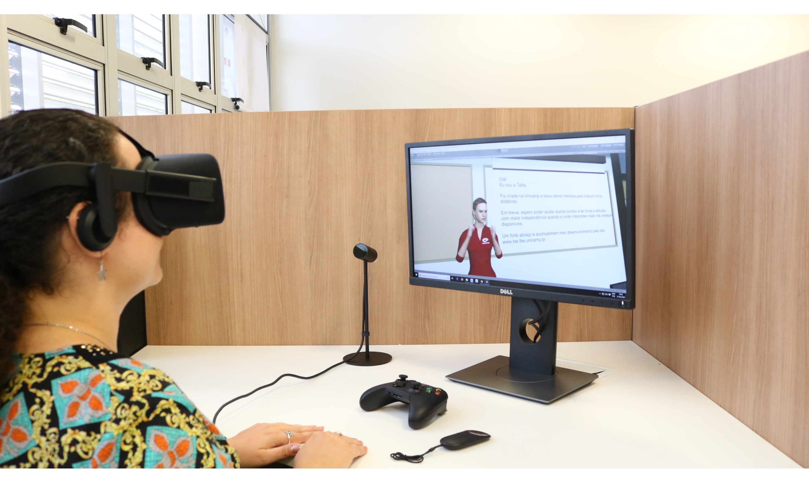

---
#
# By default, content added below the "---" mark will appear in the home page
# between the top bar and the list of recent posts.
# To change the home page layout, edit the _layouts/home.html file.
# See: https://jekyllrb.com/docs/themes/#overriding-theme-defaults
#
layout: home
title:
exclude: true
---

{: style="text-align: justify; margin-top:1cm; margin-bottom:1cm;" }
Hi! I'm Rodolfo, a PhD candidate at the University of Campinas (UNICAMP). My supervisor is [Paula D. P. Costa](https://pdpcosta.github.io/) and I'm also a member of the [Artificial Intelligence Lab, Recod.ai](https://recod.ai/)

{: style="text-align: justify;"}
My research interests include:
- Computer animation and behavioral AI
- Motion Capture and computer graphics
- Machine learning and generative modelling
- Virtual and augmented reality

 
### **Some of my work**

    

      <figure >
        
        <figcaption style="text-align:center">PhD</figcaption>
      </figure>
      <figure >
        
        <figcaption style="text-align:center">MSc</figcaption>
      </figure>
      <figure >
        
        <figcaption style="text-align:center">Projects</figcaption>
      </figure>
    

  

 
### **News**

{: style="text-align: justify; margin-top:1cm; margin-bottom:1cm;" }

* <strong>May 2024</strong> I, along with other Unicamp students and Professor José Mario de Martino, recently participated in [Qualcomm's University Platforms Symposium](https://assets.qualcomm.com/University-Platforms-Symposium-Reg.html?cmpid=socnpd-uWw2VjGczF&utm_medium=socnpd&utm_source=Linkedin&utm_campaign=university-platforms-symposium). At the symposium, I had the opportunity to present our research on developing sign language avatars for use in XR environments.

* <strong>Nov 2023</strong> I'm glad to announce that UNICAMP hosted the [12th EAI International Conference: ArtsIT, Interactivity & Game Creation (ArtsIT 2023)](https://artsit.eai-conferences.org/2023) in November.

* <strong>Oct 2023</strong> I presented the paper [Gesture Generation with Diffusion Models Aided by Speech Activity Information](https://dl.acm.org/doi/abs/10.1145/3610661.3616554) at the [ICMI 2023](https://icmi.acm.org/2023/) in Paris, France.

* <strong>Sep 2023</strong> I released the first version of the bvhsdk python library. bvhsdk is a small but versatile Python library for students and researchers designed for the management of BVH files. The library is available in [PyPI](https://pypi.org/project/bvhsdk/), the [code](https://github.com/rltonoli/bvhsdk) and [documentation](https://bvhsdk.readthedocs.io/) are also available.

* <strong>Aug 2023</strong> Our paper [Gesture Generation with Diffusion Models Aided by Speech Activity Information](https://dl.acm.org/doi/abs/10.1145/3610661.3616554) was accepted at [ICMI 2023](https://icmi.acm.org/2023/) as part of the [GENEA Challenge 2023](https://genea-workshop.github.io/2023/challenge/).

* <strong>Dec 2022</strong> Our team from FEEC/UNICAMP, in partnership with [Qualcomm](https://www.qualcomm.com/), showcased a demonstration of the sign language avatar from the [TAS project](https://www.tas.fee.unicamp.br/) using the [AR ThinkReality A3 Smart Glasses](https://www.lenovo.com/us/en/thinkrealitya3/) at the [IEEE Globecom 2022](https://globecom2022.ieee-globecom.org/). This demonstration was conducted under the guidance of Prof. José Mario De Martino.

* <strong>Nov 2022</strong> I participated in the organizing committee of the [EADCA 2022](https://www.s-drupal.fee.unicamp.br/dca/eadca).

* <strong>Jul 2022</strong> We submitted our side-project [aitmospheric](https://aitmospheric.vercel.app/) to the [1st hackathon of The Sound of AI](https://musikalkemist.github.io/thesoundofaihackathon/). [Code](https://github.com/leonardoboulitreau/aitmospheric) is available.

* <strong>Nov 2020</strong> I participated in the organizing committee of the [EADCA 2020](https://www.fee.unicamp.br/dca/eadca-2020/) and presented our work titled Síntese de Gestos por Voz em Agentes Virtuais (Speech-driven Gesture Generation in Virtual Agents).

* <strong>Oct 2020</strong> I gave a talk titled Computer Animation: Applications and New Technologies for [UNASP](https://unasp.br/) to Computer Engineering and Information Systems students.

* <strong>Aug 2019</strong> I defended my MSc thesis [Motion Retargeting Preserving Spatial Relationship](https://hdl.handle.net/20.500.12733/1639986).

* <strong>Oct 2018</strong> I gave a talk about our research [Signing Avatar in Virtual Reality](https://www.dca.fee.unicamp.br/~paula/pdf/tonoli2018signing.pdf) at the [20th Symposium on Virtual and Augmented Reality (SVR 2018)](https://svr.sbc.org.br/svr2018/).

